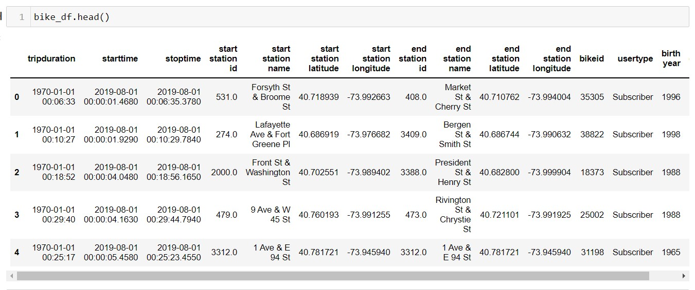

# NYC Citi Bike Analysis August 2019

## Overview 
Citi Bike is the nation's largest bike share program, with 25,000 bikes and over 1,500 stations across Manhattan, Brooklyn, Queens, the Bronx, Jersey City and Hoboken. Many users choose Citi Bikes to save money and time, get exercise, go "green",  and have fun! Designed with convenience in mind for quick trips, Citi Bike is a fun and affordable way to get around town.

In this analysis, August 2019 data was used to understand different metrics such as the following:
* Average trip duration for all riders and genders
* Number of bike trips for all riders and genders for each hour of each day of the week
* Number of bike trips for each type of user and gender for each day of the week.

## Results
Before the data was imported into Tableau, Python/Pandas was used to convert the "tripduration" column to a datetime datatype by passing the DataFrame column and the units inside the to_datetime() function.

The converted data was then imported in Tableau and many visualizations were created.
The entire Tableau dashboard can be found here: [TABLEAU](https://public.tableau.com/views/challenge_bike_sharing/Story1?:language=en-US&publish=yes&:display_count=n&:origin=viz_share_link)

### Visualizations
Here are 7 different visualizations completed in Tableau
#### #1 - Number of Trip in August 2019

This was a simple task, it just counted the number of entries in the datafile.

#### #2- Checkout Time by Users

This graph showed that most people used the bikes between 1 and 60 minutes, with 5 minutes being the most common.

#### #3 - Checkout Time by Gender

This graph shows that gender didn't really affect the checkout time.

#### #4 - Trips by Weekday per Hour

This graph shows that Monday, Tuesday, and Thursday are the most popular days to rent bikes. Also, the most popular times to use the bikes are between 7-9 am and 4-7pm.

#### #5 - Trips by Gender (Weekday per Hour)
.png)
The results of this visualization show that the peak times for riding the bikes do not vary much between genders. It is also noticeable that males are using the bikes the most.

#### #6 - User Trips by Gender & Usertype by Weekday

This graph shows the following:
  &nbsp;  (1) Males use the bikes more than the other genders 
  &nbsp; (2) Subscribers use the bikes more than non-subscribers. 

#### #7 - August 2019 Peak Hours

This graph shows that in August 2019, the top 3 most popular times to rent a bike are:
  &nbsp;&nbsp; #1  - 5 pm with 224,566 users
  &nbsp;&nbsp; #2  - 6 pm with 215,783 users
  &nbsp;&nbsp; #2  - 8 am with 170,730 users

## Summary
I think it is very clear that the CitiBike bike sharing business is very popular.  As an investor, I would want to see more details such as overhead cost, profits, and trends throughout the year.  Maybe there could be some more investigation into why males tend to use the bikes more than females and some efforts could be made to attract more females. I would also like to know the average daily population in NYC (including tourists) in comparison to the average daily use.  
